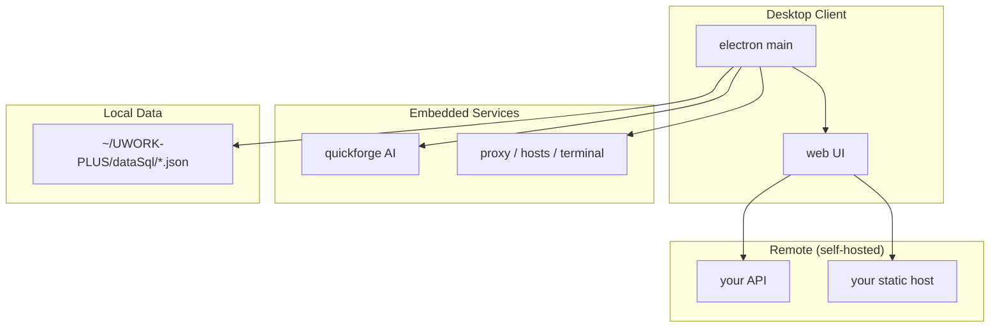

# UworkPlus

**Languages:** English · [中文](README.zh.md)

A personal R&D workbench that bundles **shell script shortcuts**, **app/site navigation**, **notes & docs**, **API proxy & debugging**, **Hosts management**, **code snippets**, and **AI chat (QuickForge)** into one desktop client, with a Web UI and supporting toolchain.

- Official site: https://tpdoc.cn/uworkplus/introduction?origin=custom
- Live demo (self-hosted): set `VITE_REMOTE_ORIGIN`, then open `{ORIGIN}/uworkplus/`
- Repository: https://gitee.com/redorc/uwork-plus-top.git
- GitHub: https://github.com/Caofh/uwork-plus-top.git

---

## What It Does

UworkPlus targets day-to-day development and ops workflows—reducing scattered tools, hard-to-remember scripts, and painful environment switching:

| Scenario | Capability |
|----------|------------|
| One-click apps, sites, projects | Shell script library + voice-triggered execution + app/site navigation |
| Local environment setup | Home page “Install dev env” / “Install software”, runs in a separate Terminal |
| Network debugging | API proxy (MITM), Hosts switching, API debugger |
| Knowledge base | Online/local docs, code snippets, JSON diff |
| AI assistance | Embedded QuickForge—local-first AI chat and project tools |
| Desktop enhancements | Electron: terminal, clipboard, auto-update, system proxy, etc. |

The client is **Electron shell + Vue 3 frontend**; the frontend can also run in a browser (some features require Electron).

---

## Repository Layout

```
uwork-plus/
├── web/                          # Main frontend (Vue 3 + Vite + Element Plus)
├── electron/                     # Electron main process & packaging
├── mini-markdown-editor/         # Markdown editor monorepo (used by docs module)
├── quickforge/                   # AI workbench (Git submodule)
├── uworkplus-code/               # VS Code / Cursor extension
├── uworkplus-code-lowcodeEditor/ # Low-code Schema editor (Web)
├── scripts/                      # Shared root scripts (deploy, submodule checks, etc.)
└── package.json                  # Root orchestration scripts
```

### Local Data Directory

Electron stores core JSON data under the user home directory:

| Environment | Path |
|-------------|------|
| Development | `~/UWORK-PLUS-dev/dataSql/` |
| Production | `~/UWORK-PLUS/dataSql/` |

Important files include `data.json` (shell scripts), `document.json` (articles), `dataSnippet.json` (code snippets), and more.

---

## Requirements

- **Node.js**: `22.18.0` (required by root, `web`, and `electron`)
- **Package managers**: **yarn** at root and most subprojects; **pnpm** for `mini-markdown-editor`
- **OS**: macOS-first (terminal, proxy, Hosts, DMG builds); partial Windows Electron build support
- **Git submodule**: `quickforge` must be initialized separately

First-time clone:

```bash
git clone --recursive https://gitee.com/redorc/uwork-plus-top.git
git clone --recursive https://github.com/Caofh/uwork-plus-top.git
cd uwork-plus-top
```

If already cloned without submodules:

```bash
git submodule update --init --recursive
```

---

<a id="configuration"></a>

## Configuration

UworkPlus does **not** ship with a public backend. Copy `web/.env.example` to `web/.env.local`:

| Variable | Description |
|----------|-------------|
| `VITE_REMOTE_ORIGIN` | Remote CDN/API origin (e.g. `https://your-cdn.example.com`) |
| `VITE_API_BASE_URL` | API base (default `{ORIGIN}/api_2020/iwork`, or `/api` when unset) |
| `VITE_API_BASE_COMMON` | Common API prefix (default `{ORIGIN}/api_2020`) |
| `VITE_UPDATES_INFO_URL` | Electron update manifest JSON |
| `VITE_SOFTWARE_LIST_URL` / `VITE_DEV_ENV_LIST_URL` | Software / dev-env list URLs |
| `VITE_LOWCODE_EDITOR_URL` | Low-code editor URL |
| `VITE_DEMO_API_TOKEN` | Optional API token for the demo page only |

For Electron, set `UWORK_REMOTE_ORIGIN`, `TENCENT_SECRET_ID`, etc. See `web/.env.example` and [SECURITY.md](./SECURITY.md).

---

## Quick Start (Root)

### Install All Dependencies

```bash
yarn install:all
```

Installs dependencies for `web`, `mini-markdown-editor`, `quickforge` (submodule check first), and `electron`.

### Development

```bash
# Web only (http://localhost:5173/uworkplus/)
yarn dev:web

# QuickForge only (default port 5190 when integrated with Electron)
yarn dev:quickforge

# Markdown editor only
yarn dev:mini

# Electron client (waits 3s for web, then opens desktop window)
yarn dev:electron

# Start web + mini + quickforge + electron together
yarn dev:all
```

Recommended: `yarn dev:all`, or run `yarn dev:web` and `yarn dev:electron` in two terminals.

### Build

```bash
yarn build:web        # Build frontend dist
yarn build:mini       # Build markdown editor
yarn build:electron   # Build Electron (arm64 DMG; see electron/README.md)
yarn build:all        # Parallel build: web + mini + electron
```

### Deploy to Server

Deploy credentials come from `DEPLOY_HOST` / `DEPLOY_PASSWORD` or local `CFH-CONFIG` in `~/UWORK-PLUS/dataSql/dataSnippet.json` (never commit this file).

```bash
# Deploy Web static assets (adjust remote path for your server)
yarn publishAli2:web

# Deploy Markdown editor static assets
yarn publishAli2:mini

# Deploy Electron (auto bump version, arm64/x64 packages, upload updates)
yarn publishAli2:electron -- "Release notes"
yarn publishAli2:electron -- 1.12.0 "Release with pinned version"
```

---

## Subprojects

### 1. `web/` — Main Frontend

**Stack**: Vue 3, TypeScript, Vite 7, Element Plus, Pinia, Tailwind CSS, Monaco Editor, xterm.js

**Main modules** (Dock navigation):

| Module | Path | Description |
|--------|------|-------------|
| Home | `/home` | Carousel nav, tasks, hot search, dev env / software install |
| AI chat | `/aiWebUI` | Embedded QuickForge (client ≥ 1.8.0) |
| Shell scripts | `/sh` | Script library, internal/external terminal, voice matching |
| Apps & sites | `/application` | Personal app navigation (login required) |
| Docs / notes | `/document` | Online docs & local notes (login required) |
| Tools | `/tools/*` | See table below |
| User center | `/userCenter` | Profile (login required) |

**Tool submodules** (`/tools`):

| Tool | Route | Description |
|------|-------|-------------|
| API proxy | `/tools/switchProxy` | HTTP proxy, MITM cert, rule forwarding |
| Hosts | `/tools/switchHosts` | Multi-profile system hosts (≥ 1.10.0) |
| API debugger | `/tools/apiDebug` | HTTP request debugging (≥ 1.11.0) |
| Code snippets | `/tools/code` | Snippet & folder management |
| Scaffold | `/tools/scaffold` | Project scaffold generator |
| JSON viewer | `/tools/jsonView` | JSON format & inspect |
| JSON diff | `/tools/responseCompare` | API response structure diff |
| Webview | `/tools/webview` | Embedded page manager |

**Commands**:

```bash
cd web
yarn install
yarn dev              # Dev server: http://localhost:5173/uworkplus/
yarn build            # Production build
yarn build:staging    # Staging build
yarn publishAli2      # Build and deploy to server
```

API base URL is set in `web/src/config/index.js` via `NODE_ENV` and `web/.env.local`. Without `VITE_REMOTE_ORIGIN`, the default is `/api`; when set, defaults to `{ORIGIN}/api_2020/iwork`.

Copy `web/.env.example` to `web/.env.local` to override remote endpoints and optional settings.

---

### 2. `electron/` — Desktop Shell

**Responsibilities**: Load `web` build or dev server, plus native capabilities:

- Internal / external Terminal for shell scripts (`node-pty`)
- Local JSON storage (`proxySql`)
- HTTP proxy, system proxy toggle, MITM root CA
- Hosts read/write and switching
- Clipboard, file picker, Git clone
- Auto-update (DMG + update package upload)
- Voice wake-up, Tencent Cloud ASR
- Open system browser, standalone module windows

**Commands**:

```bash
cd electron
yarn install
yarn setup                    # Install deps and rebuild node-pty (arm64)
yarn start                    # Dev mode (requires web dev server)
yarn build-unsigned           # arm64 DMG (unsigned)
yarn build-x64-unsigned       # x64 DMG (cross-compile on Apple Silicon)
yarn publishAli2 -- "Release notes"
```

**Notes**:

- Run `yarn rebuild-native-arm64` after each `yarn install`
- If the packaged app is unresponsive, launch from terminal:
  `/Applications/UworkPlus.app/Contents/MacOS/UworkPlus`
- See [`electron/README.md`](electron/README.md) for release, Python/distutils, and arch issues

Dev loads `http://localhost:5173/uworkplus/`; production loads static assets from `dist/`.

---

### 3. `mini-markdown-editor/` — Markdown Editor

pnpm monorepo providing Markdown editing for the docs module; can also be developed and published standalone.

```
packages/
├── mini-markdown-ast-parser   # AST parser
├── mini-markdown-editor       # React editor package
└── mini-markdown-play         # Demo / test app
```

**Commands** (monorepo root):

```bash
cd mini-markdown-editor
pnpm install
pnpm dev:editor                # Dev editor
pnpm build:editor              # Build editor
```

Root orchestration:

```bash
yarn dev:mini
yarn build:mini
yarn publishAli2:mini          # Deploy to /data/web/pro/uworkplusMarkdown
```

---

### 4. `quickforge/` — AI Workbench (Submodule)

Local-first AI chat and dev assistant, integrated in UworkPlus “AI chat” page. Supports multi-model, project context, MCP, Skills, scheduled tasks, YOLO local file/shell tools, and more.

- Submodule repo: https://gitee.com/redorc/quick-forge.git
- Default config/data: `~/.quickforge/`
- UworkPlus bundled Skills: `quickforge/uworkPlus-default-skills/` (e.g. `local-database`)

**Commands**:

```bash
cd quickforge
npm install                    # or yarn install
npm run dev                    # Dev mode; port 5190 when integrated with UworkPlus
npm run build && npm start     # Production build and start
```

Root:

```bash
yarn dev:quickforge            # Checks submodule first
```

In the UworkPlus client, Electron starts QuickForge; the UI embeds it via iframe.

See [`quickforge/README.md`](quickforge/README.md) for full configuration.

---

### 5. `uworkplus-code/` — VS Code / Cursor Extension

Companion extension for UworkPlus. Explorer context menu:

- Download component into current folder
- Generate low-code JsonSchema file
- Open low-code web page

Sidebar: module components and code snippets views.

**Commands**:

```bash
cd uworkplus-code
npm install
npm run compile                # TypeScript → out/
npm run watch                  # Watch mode

# Press F5 in VS Code to launch Extension Development Host
```

Run `npm run vscode:prepublish` before publishing.

---

### 6. `uworkplus-code-lowcodeEditor/` — Low-Code Editor

Vue 3 + Vite visual Schema editor; works with the `uworkplus-code` extension.

- **Node.js**: `22.18.0` (`preinstall` enforces this)
- **pnpm** recommended; yarn / npm also work

```bash
cd uworkplus-code-lowcodeEditor
pnpm install
pnpm run dev                   # http://localhost:5173
pnpm run build:prod
pnpm run publishAli2           # Deploy to /data/web/pro/lowcodeEditor
```

---

### 7. `scripts/` — Shared Scripts

| Script | Purpose |
|--------|---------|
| `ensure-submodules.js` | Verify Git submodules are initialized |
| `scp-deploy.js` | Read local config and SCP-deploy a directory |
| `scp-upload.exp` | expect script for SCP password automation |
| `read-deploy-config.js` | Read `CFH-CONFIG` deploy info from `dataSnippet.json` |

---

## Architecture (Overview)



---

## FAQ

### Submodule Not Ready

```
[submodule] 以下子模块尚未拉取完成: quickforge
```

Run: `git submodule update --init --recursive`

### Terminal / SSH Issues in DMG Build

Packaged builds may route `ssh` and similar PTY commands to the system Terminal. See `electron/main.js` and `electron/README.md`.

### Web-Only Development (No Electron)

```bash
yarn dev:web
# Open http://localhost:5173/uworkplus/
```

Terminal execution, proxy, Hosts, and auto-update require Electron.

---

## Links

| Resource | Notes |
|----------|-------|
| Official site / product intro | https://tpdoc.cn/uworkplus/introduction?origin=custom |
| Web entry | `{VITE_REMOTE_ORIGIN}/uworkplus/` (self-hosted) |
| Product intro (self-hosted) | `{VITE_REMOTE_ORIGIN}/uworkplus/introduction` |
| Electron update manifest | `{VITE_REMOTE_ORIGIN}/updates/update-info-latest.json` |
| App list API | `{VITE_REMOTE_ORIGIN}/api_2020/iwork/appList/getAppList` |
| Article list API | `{VITE_REMOTE_ORIGIN}/api_2020/iwork/articleList/getArticleList` |

Replace `{VITE_REMOTE_ORIGIN}` with your domain or set the matching variables in `.env.local`.

---

## Security

See [SECURITY.md](./SECURITY.md). UworkPlus runs shell commands and can install a local MITM certificate—use only on trusted development machines.

---

## License

Subproject licenses are defined in each directory; the root repository is MIT.
