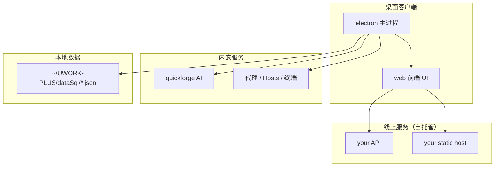

# UworkPlus

**Languages:** [English](README.md) · 中文

个人研发工作台：把 **sh 脚本快捷执行**、**应用/网站导航**、**文档笔记**、**接口代理与调试**、**Hosts 管理**、**代码沉淀**、**AI 会话（QuickForge）** 等能力整合在一个桌面客户端里，同时提供 Web 端与配套工具链。

- 官网：<a href="https://tpdoc.cn/uworkplus/introduction?origin=custom" target="_blank" rel="noopener noreferrer">https://tpdoc.cn/uworkplus/introduction?origin=custom</a>
- 线上演示（需自行部署）：配置 `VITE_REMOTE_ORIGIN` 后访问 `{ORIGIN}/uworkplus/`
- 仓库地址：https://gitee.com/redorc/uwork-plus-top.git
- GitHub：https://github.com/Caofh/uwork-plus-top.git

---

## 项目是干什么的

UworkPlus 面向日常研发与运维场景，解决「工具分散、脚本难记、环境切换麻烦」的问题：

| 场景 | 能力 |
|------|------|
| 一键打开系统/网站/项目 | sh 脚本库 + 语音唤醒执行 + 应用网站导航 |
| 本地环境搭建 | 首页「安装开发环境」「安装软件」，在独立 Terminal 中执行 |
| 网络调试 | 接口代理（MITM）、Hosts 切换、接口调试 |
| 知识沉淀 | 在线/本地文档、代码片段、JSON 比对 |
| AI 辅助 | 内嵌 QuickForge，本地优先的 AI 对话与项目工具 |
| 桌面增强 | Electron 提供终端、剪贴板、自动更新、系统代理等原生能力 |

客户端形态为 **Electron 壳 + Vue 3 前端**；前端也可单独在浏览器访问（部分能力需 Electron）。

---

## 仓库结构

```
uwork-plus/
├── web/                          # 主前端（Vue 3 + Vite + Element Plus）
├── electron/                     # Electron 主进程与打包发布
├── mini-markdown-editor/         # Markdown 编辑器 monorepo（文档模块依赖）
├── quickforge/                   # AI 工作台（Git Submodule）
├── uworkplus-code/               # VS Code / Cursor 扩展
├── uworkplus-code-lowcodeEditor/ # 低代码 Schema 编辑器（Web）
├── scripts/                      # 根目录共享脚本（部署、Submodule 检查等）
└── package.json                  # 根目录统一编排脚本
```

### 本地数据目录

Electron 会将核心 JSON 数据存放在用户目录：

| 环境 | 路径 |
|------|------|
| 开发 | `~/UWORK-PLUS-dev/dataSql/` |
| 生产 | `~/UWORK-PLUS/dataSql/` |

重要文件包括 `data.json`（sh 脚本）、`document.json`（文章）、`dataSnippet.json`（代码片段）等。

---

## 环境要求

- **Node.js**：`22.18.0`（根目录、`web`、`electron` 均要求此版本）
- **包管理器**：根目录与多数子项目用 **yarn**；`mini-markdown-editor` 用 **pnpm**
- **系统**：macOS 为主（终端、代理、Hosts、DMG 打包）；Windows 有部分 Electron 构建支持
- **Git Submodule**：`quickforge` 需单独初始化

首次克隆请使用：

```bash
git clone --recursive https://gitee.com/redorc/uwork-plus-top.git
git clone --recursive https://github.com/Caofh/uwork-plus-top.git
cd uwork-plus-top
```

若已克隆但未拉取子模块：

```bash
git submodule update --init --recursive
```

---

<a id="配置"></a>

## 配置

UworkPlus **不内置公共后端**。复制 `web/.env.example` 为 `web/.env.local`，按需填写：

| 变量 | 说明 |
|------|------|
| `VITE_REMOTE_ORIGIN` | 远程 CDN/API 根地址（如 `https://your-cdn.example.com`） |
| `VITE_API_BASE_URL` | API 基址（默认 `{ORIGIN}/api_2020/iwork`，未配置时为 `/api`） |
| `VITE_API_BASE_COMMON` | 公共 API 前缀（默认 `{ORIGIN}/api_2020`） |
| `VITE_UPDATES_INFO_URL` | Electron 更新清单 JSON |
| `VITE_SOFTWARE_LIST_URL` / `VITE_DEV_ENV_LIST_URL` | 软件/开发环境列表 |
| `VITE_LOWCODE_EDITOR_URL` | 低代码编辑器地址 |
| `VITE_DEMO_API_TOKEN` | 仅 Demo 页可选 API token |

Electron 主进程可通过 `UWORK_REMOTE_ORIGIN`、`TENCENT_SECRET_ID` 等环境变量覆盖，详见 `web/.env.example` 与 [SECURITY.md](./SECURITY.md)。

---

## 快速开始（根目录）

### 安装全部依赖

```bash
yarn install:all
```

会依次安装 `web`、`mini-markdown-editor`、`quickforge`（会先检查 submodule）、`electron` 的依赖。

### 开发模式

```bash
# 仅 Web 前端（http://localhost:5173/uworkplus/）
yarn dev:web

# 仅 QuickForge（默认端口 5190，由 electron 集成时使用）
yarn dev:quickforge

# 仅 Markdown 编辑器
yarn dev:mini

# Electron 客户端（会先 sleep 3s 等待 web 启动，再打开桌面窗口）
yarn dev:electron

# 一键启动 web + mini + quickforge + electron
yarn dev:all
```

推荐日常开发：`yarn dev:all`，或分开两个终端运行 `yarn dev:web` 与 `yarn dev:electron`。

### 构建

```bash
yarn build:web        # 构建前端 dist
yarn build:mini       # 构建 markdown 编辑器
yarn build:electron   # 构建 Electron（arm64 DMG，见 electron 目录说明）
yarn build:all        # 并行构建 web + mini + electron
```

### 发布到线上服务器

部署配置通过环境变量 `DEPLOY_HOST` / `DEPLOY_PASSWORD` 或本地 `~/UWORK-PLUS/dataSql/dataSnippet.json` 中的 `CFH-CONFIG` 读取（勿提交到仓库）。

```bash
# 发布 Web 静态资源（remote-path 按你的服务器目录调整）
yarn publishAli2:web

# 发布 Markdown 编辑器静态资源
yarn publishAli2:mini

# 发布 Electron 客户端（自动 bump 版本、打 arm64/x64 包、上传更新）
yarn publishAli2:electron -- "本次更新说明"
yarn publishAli2:electron -- 1.12.0 "指定版本发布"
```

---

## 子项目说明

### 1. `web/` — 主前端

**技术栈**：Vue 3、TypeScript、Vite 7、Element Plus、Pinia、Tailwind CSS、Monaco Editor、xterm.js

**主要功能模块**（Dock 导航）：

| 模块 | 路径 | 说明 |
|------|------|------|
| 首页 | `/home` | 轮播导航、待办任务、热搜、开发环境/软件安装 |
| AI 会话 | `/aiWebUI` | 内嵌 QuickForge（需客户端 ≥ 1.8.0） |
| sh 脚本 | `/sh` | 脚本库管理、内部/外部终端执行、语音匹配 |
| 应用网站 | `/application` | 个人应用导航（需登录） |
| 文档 / 笔记 | `/document` | 在线文档与本地笔记（需登录） |
| 工具 | `/tools/*` | 见下表 |
| 个人中心 | `/userCenter` | 用户信息（需登录） |

**工具子模块**（`/tools`）：

| 工具 | 路由 | 说明 |
|------|------|------|
| 接口代理 | `/tools/switchProxy` | HTTP 代理、MITM 证书、规则转发 |
| Hosts 管理 | `/tools/switchHosts` | 多配置切换系统 hosts（≥ 1.10.0） |
| 接口调试 | `/tools/apiDebug` | API 请求调试（≥ 1.11.0） |
| 代码沉淀 | `/tools/code` | 代码片段与文件夹管理 |
| 脚手架 | `/tools/scaffold` | 项目脚手架生成 |
| JSON 转换器 | `/tools/jsonView` | JSON 格式化与查看 |
| JSON 比对 | `/tools/responseCompare` | 接口响应结构 diff |
| Webview | `/tools/webview` | 内嵌网页管理 |

**常用命令**：

```bash
cd web
yarn install
yarn dev              # 开发，默认 http://localhost:5173/uworkplus/
yarn build            # 生产构建
yarn build:staging    # 预发构建
yarn publishAli2      # 构建并部署到服务器
```

API 基址在 `web/src/config/index.js` 中按 `NODE_ENV` 与 `web/.env.local` 切换；未配置 `VITE_REMOTE_ORIGIN` 时默认 `/api`，配置后默认 `{ORIGIN}/api_2020/iwork`。

---

### 2. `electron/` — 桌面客户端壳

**职责**：加载 `web` 构建产物或开发服务器页面，并提供原生能力：

- 内部 / 外部 Terminal 执行 sh 脚本（`node-pty`）
- 本地 JSON 数据库读写（`proxySql`）
- HTTP 代理服务、系统代理开关、MITM 根证书
- Hosts 读写与切换
- 剪贴板、文件选择、Git 仓库下载
- 自动更新（DMG + 更新包上传）
- 语音唤醒、腾讯云 ASR
- 打开系统浏览器、独立模块窗口

**常用命令**：

```bash
cd electron
yarn install
yarn setup                    # 安装依赖并 rebuild node-pty (arm64)
yarn start                    # 开发模式启动（需 web dev 服务）
yarn build-unsigned           # 打 arm64 DMG（无签名）
yarn build-x64-unsigned       # 打 x64 DMG（M 系列 Mac 交叉编译）
yarn publishAli2 -- "更新说明"  # 一键发布流程
```

**注意**：

- 每次 `yarn install` 后建议执行 `yarn rebuild-native-arm64`
- 打包后若客户端无响应，可用 `/Applications/UworkPlus.app/Contents/MacOS/UworkPlus` 在终端查看报错
- 详细发布、Python/distutils、架构问题见 [`electron/README.md`](electron/README.md)

开发时 `electron` 加载 `http://localhost:5173/uworkplus/`；生产加载打包进 `dist/` 的静态资源。

---

### 3. `mini-markdown-editor/` — Markdown 编辑器

**说明**：pnpm monorepo，为文档模块提供 Markdown 编辑能力，也可独立开发发布。

```
packages/
├── mini-markdown-ast-parser   # AST 解析器
├── mini-markdown-editor       # React 编辑器主包
└── mini-markdown-play         # 演示/测试项目
```

**常用命令**（在 monorepo 根目录）：

```bash
cd mini-markdown-editor
pnpm install
pnpm dev:editor                # 开发编辑器
pnpm build:editor              # 构建编辑器
```

根目录编排（只构建主包）：

```bash
yarn dev:mini
yarn build:mini
yarn publishAli2:mini          # 部署到 /data/web/pro/uworkplusMarkdown
```

---

### 4. `quickforge/` — AI 工作台（Submodule）

**说明**：本地优先的 AI 对话与研发辅助工具，集成在 UworkPlus 的「AI 会话」页。支持多模型、项目上下文、MCP、Skills、定时任务、YOLO 本地文件/命令工具等。

- Submodule 仓库：https://gitee.com/redorc/quick-forge.git
- 配置与数据默认目录：`~/.quickforge/`
- UworkPlus 内置 Skills：`quickforge/uworkPlus-default-skills/`（如 `local-database`）

**常用命令**：

```bash
cd quickforge
npm install                    # 或 yarn install
npm run dev                    # 开发模式，UworkPlus 集成时端口 5190
npm run build && npm start     # 生产构建并启动
```

根目录：

```bash
yarn dev:quickforge            # 会先检查 submodule 是否就绪
```

在 UworkPlus 客户端中，Electron 会负责拉起 QuickForge 服务，前端通过 iframe 嵌入。

完整功能与配置见 [`quickforge/README.md`](quickforge/README.md)。

---

### 5. `uworkplus-code/` — VS Code / Cursor 扩展

**说明**：配合 UworkPlus 客户端使用的编辑器插件，在资源管理器右键提供：

- 下载组件到当前文件夹
- 生成低代码 JsonSchema 文件
- 打开低代码 Web 页面

侧边栏还提供「模块组件」「代码片段」视图。

**常用命令**：

```bash
cd uworkplus-code
npm install
npm run compile                # 编译 TypeScript → out/
npm run watch                  # 监听编译

# 在 VS Code 中按 F5 启动扩展开发宿主
```

发布前执行 `npm run vscode:prepublish`。

---

### 6. `uworkplus-code-lowcodeEditor/` — 低代码编辑器

**说明**：Vue 3 + Vite 低代码 Schema 可视化编辑 Web 应用，与 `uworkplus-code` 扩展联动。

- **Node 版本要求**：`22.18.0`（该子项目 `preinstall` 会校验）
- 推荐 **pnpm**，yarn / npm 也可用

```bash
cd uworkplus-code-lowcodeEditor
pnpm install
pnpm run dev                   # http://localhost:5173
pnpm run build:prod
pnpm run publishAli2           # 部署到 /data/web/pro/lowcodeEditor
```

---

### 7. `scripts/` — 共享脚本

| 脚本 | 用途 |
|------|------|
| `ensure-submodules.js` | 检查 Git Submodule 是否已初始化 |
| `scp-deploy.js` | 读取本地配置，通过 SCP 部署目录到服务器 |
| `scp-upload.exp` | expect 脚本，供 SCP 自动输入密码 |
| `read-deploy-config.js` | 从 `dataSnippet.json` 读取 `CFH-CONFIG` 部署信息 |

---

## 架构关系（简图）



---

## 常见问题

### Submodule 未就绪

```
[submodule] 以下子模块尚未拉取完成: quickforge
```

执行：`git submodule update --init --recursive`

### Electron 终端 / SSH 在 DMG 中异常

打包版对 `ssh` 等需要伪终端的命令，可能自动转系统 Terminal 执行。详见 `electron/main.js` 与 `electron/README.md`。

### 仅开发 Web、不用 Electron

```bash
yarn dev:web
# 浏览器打开 http://localhost:5173/uworkplus/
```

部分能力（终端执行、代理、Hosts、自动更新）仅在 Electron 中可用。

---

## 相关链接

| 资源 | 说明 |
|------|------|
| 官网 / 产品介绍 | <a href="https://tpdoc.cn/uworkplus/introduction?origin=custom" target="_blank" rel="noopener noreferrer">https://tpdoc.cn/uworkplus/introduction?origin=custom</a> |
| 前端入口 | `{VITE_REMOTE_ORIGIN}/uworkplus/`（自托管） |
| 产品介绍（自托管） | `{VITE_REMOTE_ORIGIN}/uworkplus/introduction` |
| Electron 更新清单 | `{VITE_REMOTE_ORIGIN}/updates/update-info-latest.json` |
| 应用列表 API | `{VITE_REMOTE_ORIGIN}/api_2020/iwork/appList/getAppList` |
| 文章列表 API | `{VITE_REMOTE_ORIGIN}/api_2020/iwork/articleList/getArticleList` |

以上 URL 均需替换为你自己的域名，或通过 `.env.local` 配置对应变量。

---

## 安全

详见 [SECURITY.md](./SECURITY.md)。UworkPlus 会执行 Shell 命令并可能安装本地 MITM 证书，请仅在可信的开发机上使用。

---

## 许可证

各子项目许可证以各自目录为准；根仓库为 MIT。
